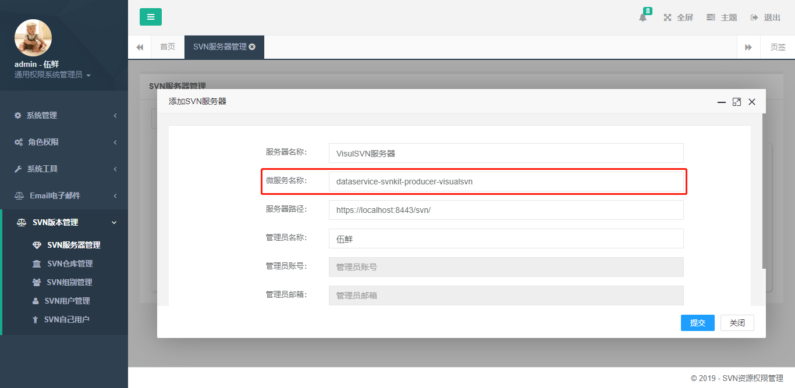

# Svnkit软件安装

Svnkit软件安装，即SVN资源权限管理系统的打包部署。

## 打包命令
```bash
git clone https://gitee.com/hy-wux/DataService-Svnkit.git
cd DataService-Svnkit
mvn clean package -P svnkit-deploy
```
> 提示：  
1、如果需要运行脚手架中的通用权限管理框架，那么打包命令为：`mvn clean package -P admin-deploy`  
2、如果需要运行项目中的SVN资源权限管理系统，那么打包命令为：`mvn clean package -P svnkit-deploy`  

打包完成后，会在以下三个模块中生成目标文件：`*.tar.gz`
* `dataservice-svnkit-registry/dataservice-svnkit-eureka`
* `dataservice-svnkit-springcloud/dataservice-svnkit-springcloud-consumer`
* `dataservice-svnkit-springcloud/dataservice-svnkit-springcloud-producer`

解压`*.tar.gz`会得到如下的目录结构
```bash
ProjectName
├── bin      -- 可执行脚本，主要提供start命令
├── config   -- 配置文件，主要用于SpringBoot程序的配置
├── docs     -- 项目文档
└── lib      -- 运行依赖jar库
```

## 软件运行

### 运行注册中心

```bash
cd dataservice-svnkit-eureka
```

1、配置

修改`config/bootstrap.yml`文件，主要修改注册中心地址及端口
```bash
server:
  port: 5550

spring:
  application:
    name: dataservice-svnkit-eureka

eureka:
  instance:
    prefer-ip-address: true
    instance-id: ${spring.cloud.client.ip-address}:${server.port}
  client:
    fetch-registry: true
    register-with-eureka: true
    serviceUrl:
      defaultZone: http://eureka.service.hy-wux.com:5550/eureka/
  server:
    enable-self-preservation: true
    renewal-percent-threshold: 0.49
```
2、运行
```bash
bin/start.sh
或者
bin\start.cmd
```

### 运行生产者

```bash
cd dataservice-svnkit-springcloud-producer
```

1、配置

修改`config/application.properties`文件，主要修改注册中心地址及SVN部署信息
```bash
# 指定应用启动端口
server.port=5551
# 指定应用服务名称，这个值需要保证唯一，前端会根据这个服务名称进行服务请求
spring.application.name=dataservice-svnkit-producer-visualsvn

# 指定本地SVN仓库的根存储路径
service.svnkit.path=E:\\Repositories\\VisualSVN
# 指定当前服务器安装的SVN软件版本，基于Windows的VisualSVN Server的具体实现使用visualsvn
service.svnkit.version=visualsvn

# 以下配置项是VisualSVN软件自身决定的，如果VisualSVN安装后没做特殊配置，即采用以下默认值，不可修改。
# 指定VisualSVN仓库配置文件，默认值为：仓库路径下的 conf/svnserve.conf
service.svnkit.svn-serve-conf=conf/svnserve.conf
# 指定VisualSVN用户配置文件，默认值为：仓库根目录下的 htpasswd
service.svnkit.passwd-file=htpasswd
# 指定VisualSVN组别配置文件，默认值为：仓库根目录下的 groups.conf
service.svnkit.group-file=groups.conf
# 指定VisualSVN权限配置文件，默认值为：仓库路径下的 conf/VisualSVN-SvnAuthz.ini
service.svnkit.authz-file=conf/VisualSVN-SvnAuthz.ini

# Eureka注册中心
eureka.instance.prefer-ip-address=true
eureka.instance.instance-id=${spring.cloud.client.ip-address}:${server.port}
eureka.client.fetch-registry=true
eureka.client.register-with-eureka=true
eureka.client.service-url.defaultZone=http://eureka.service.hy-wux.com:5550/eureka/
```
2、运行
```bash
bin/start.sh
或者
bin\start.cmd
```

### 运行消费者

```bash
cd dataservice-svnkit-springcloud-consumer
```

1、配置

修改`config/application.properties`文件，主要修改注册中心地址及数据库、WEB相关的配置
```bash
server.port=5552
spring.application.name=dataservice-svnkit-admin

jasypt.encryptor.password=EbfYkitulv73I2p0mXI50JMXoaxZTKJ7

spring.datasource.driver-class-name=com.mysql.jdbc.Driver
spring.datasource.url=jdbc:mysql://127.0.0.1:3306/dataservice_svnkit?useUnicode=true&characterEncoding=utf-8&serverTimezone=Asia/Shanghai
spring.datasource.username=internal
spring.datasource.password=internal

# 指定网站资源的存放路径，用于：自定义头像、Excel上传、文件下载等资源的存放路径，需要手工创建，并且具有读写权限
service.web.profile=/profile/

# 指定前端登录是否需要输入验证码
service.visual.web.use-kaptcha=true
# 指定验证码类型，支持：字符串charkaptcha、数学表达式mathkaptcha
service.visual.web.kaptcha-type=mathkaptcha
# 指定应用程序显示名称
service.visual.web.application-name=SVN\u8d44\u6e90\u6743\u9650\u7ba1\u7406

# Eureka注册中心
eureka.instance.prefer-ip-address=true
eureka.instance.instance-id=${spring.cloud.client.ip-address}:${server.port}
eureka.client.fetch-registry=true
eureka.client.register-with-eureka=true
eureka.client.service-url.defaultZone=http://eureka.service.hy-wux.com:5550/eureka/
```
> 提示：  
以上配置信息为明文配置，如果需要对配置信息进行加密操作，
可以调用`dataservice-svnkit-framework/service-core`中的`com.service.framework.core.encrypt.EncryptorApp`对需要加密的配置进行加密。
该类接收两个参数：加密密钥、需要加密的信息  
例如：需要加密数据库的用户名密码，配置文件中的加密密钥为：
`jasypt.encryptor.password=EbfYkitulv73I2p0mXI50JMXoaxZTKJ7`
则，调用`com.service.framework.core.encrypt.EncryptorApp`传递的参数为：`EbfYkitulv73I2p0mXI50JMXoaxZTKJ7`和`internal`

明文配置文件为
```bash
spring.datasource.url=jdbc:mysql://127.0.0.1:3306/dataservice_svnkit?useUnicode=true&characterEncoding=utf-8&serverTimezone=Asia/Shanghai
spring.datasource.username=internal
spring.datasource.password=internal
```
密文配置文件为
```bash
jasypt.encryptor.password=EbfYkitulv73I2p0mXI50JMXoaxZTKJ7

spring.datasource.driver-class-name=com.mysql.jdbc.Driver
spring.datasource.url=jdbc:mysql://127.0.0.1:3306/dataservice_svnkit?useUnicode=true&characterEncoding=utf-8&serverTimezone=Asia/Shanghai
spring.datasource.username=ENC(q0pU0BMkgtOFrQWcPgXDN5vZqrmWaJu6)
spring.datasource.password=ENC(iuYya/7omviIDMEmE5EgLjyQVFQRW4oc)
```

2、运行
```bash
bin/start.sh
或者
bin\start.cmd
```

## 软件访问

在启动完成后，可以直接访问：http://localhost:5552/  
默认用户名密码为：admin/111111。

### 服务器配置

软件运行后，需要进行服务器配置才能正常管理服务器。在添加界面，微服务名称中，填写前文配置的生产者微服务名称，即：`dataservice-svnkit-producer-visualsvn`。

