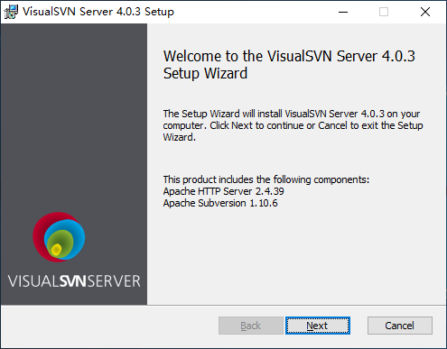
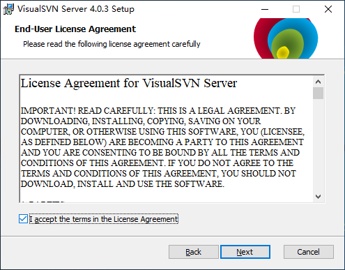
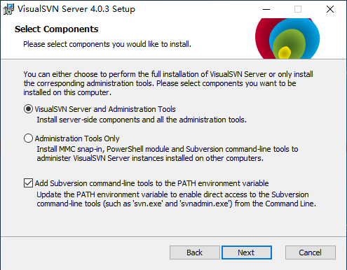
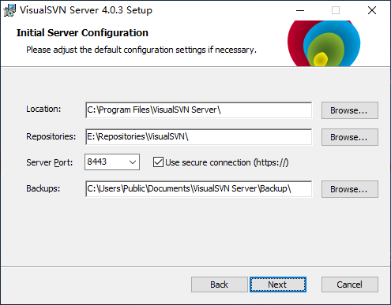
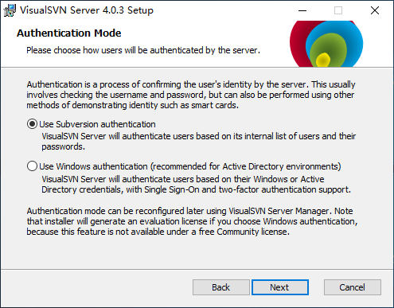
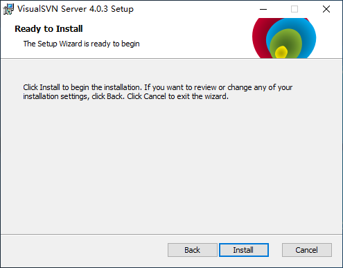
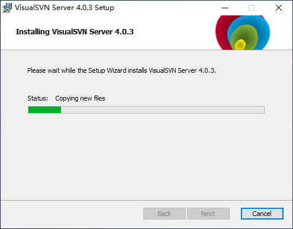
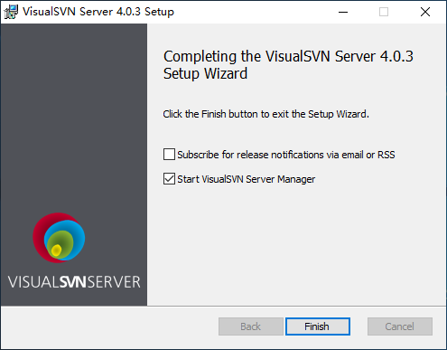
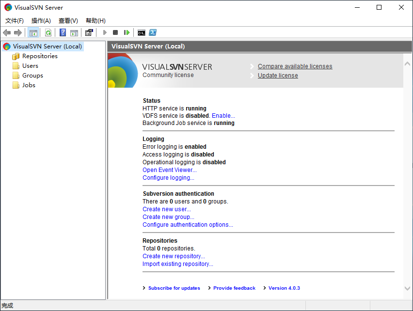

# VisualSVN软件安装

## 软件下载

下载地址：[https://www.visualsvn.com/server/download/](https://www.visualsvn.com/server/download/)

## 软件安装

VisualSVN Server的安装非常简单，只需要双击软件安装包，并按照安装向导执行，即可安装完成。

软件安装向导，直接点击下一步。

软件协议，勾选同意后点击下一步。

选择安装组件，选择安装Server和管理工具，点击下一步。

软件安装路径和仓库存储路径，设置好后点击下一步。

软件认证方式，选择使用Subversion认证，点击下一步。

确认，点击安装。

等待安装过程。

安装完成。

管理工具主界面。

至此，Visual SVN已安装成功，并且能够正常使用。
